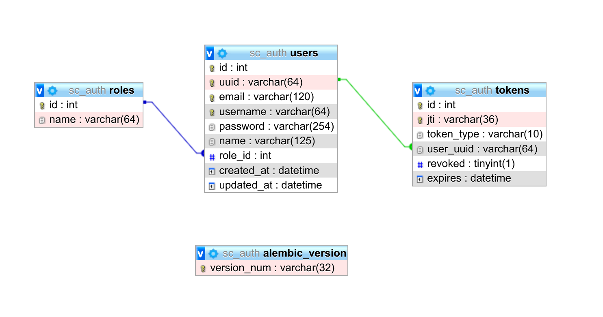

# SC-AUTH

## Arsitektur Aplikasi


Diagram diatas merupakan flow user dari internet menuju ingress hingga mencapai pod. Ingress sebenarnya adalah resource pada Kubernetes yang digunakan untuk mengexpose service ke dunia luar (internet) melalui konfigurasi host dan path untuk masing-masing service. Dari service tersebut akan meneruskan ke pod, dimana pada pod terdapat aplikasi sc-auth yang berjalan.


Saat user berhasil login, maka user akan mendapatkan `access_token` dan `refresh_token` yang digunakan untuk mengakses resource yang ada di aplikasi seperti profile dan menambahkan user baru melalui API `users` jika memiliki previleges `Admin`.

### Struktur Folder

```
.
├── api
│   └── v1
│       └── accounts.py
├── app.db
├── config.py
├── Dockerfile
├── images
│   └── db.png
├── infra
│   ├── apply.sh
│   ├── sc-auth-deployment.yaml
│   ├── sc-auth-ingress.yaml
│   ├── sc-auth-namespace.yaml
│   ├── sc-auth-secret.yaml
│   └── sc-auth-service.yaml
├── main.py
├── models
│   ├── roles.py
│   ├── tokens.py
│   └── users.py
|── README.md
├── requirements.txt
├── schemas
│   └── user.py
├── test_app.db
├── tests
│   └── test_auth.py
└── wsgi.py

```
Keterangan folder:

`api`: older yang digunakan untuk membuat backend dari apps

`config.py`: file config dari database

`infra` : folder untuk menaruh script deployment k8s

`models` : foder yang berisi model database

`schemas` : folder untuk scripts schema/input validation & ouput

`tests` : berisi test case untuk check function pada apps

`main.py` : main executor file untuk project

`wsgi.py` : digunakan untuk executor di production

## Desain Database



Terdapat 4 buah tabel utama yang digunakan pada pada aplikasi ini, yaitu users, roles, tokens dan alembic_version. 

Tabel users digunakan untuk menampung data users dengan identifier yang unique pada kolom `id, uuid, email dan username`. Agar users diketahui rolesnya terdapat kolom `role_id` yang mengarah pada tabel `roles`. Isi dari `role_id` berupa integer dengan nilai yang mereferensikan `id` dari table `roles` 

Tabel roles berperan dalam hal identifikasi role apa saja yang ada di sisi tabel `users`. Dalam kasus ini terdapat 2 roles yaitu `Admin` dan `User`. `Admin` berperan sebagai hak akses yang memanage aplikasi secara menyeluruh, sedangkan `User` hanya bisa memiliki peran standard tanpa bisa mengakases endpoint dengan privilege `Admin`.

Tabel tokens digunakan untuk tracking token yang di generate saat login dan di revoke saat logout. Sehingga ketika user melakukan logout token akan dihapus aksesnya.

Sedangkan tabel alembic_version digunakan untuk tracking migrations dari proses pembuatan/perubahan struktur tabel.

## Deployment

1. Download project

```bash
git clone https://github.com/sahalaww/sc-auth
cd sc-auth
cp .env.example .env
```
2. Membuat vituralenv python dan install dependencies
```bash
sudo apt install python3-venv python3-pip
python3 -m venv venv
source venv/bin/activate
pip install ---upgrade pip
pip install -r requirements.txt
```

### Dev Env

1. Edit File .env menjadi
```bash
DEBUG=True
SECRET_KEY=abcdefghijklmn0pqw213
CONFIG_ENV=config.DevConfig 
```

2. Init database (membuat migrations)
```bash
export FLASK_APP=main.py
flask db init
flask db migrate
flask db upgrade
# insert new data
flask seed-default-data
```

3. Run dev
```bash
flask run
```

### Docker version

1. Edit File .env menjadi
```bash
DEBUG=True
SECRET_KEY=abcdefghijklmn0pqw213
CONFIG_ENV=config.DevConfig 
```

2. Init database (membuat migrations)
```bash
export FLASK_APP=main.py
flask db init
flask db migrate
flask db upgrade
# insert new data
flask seed-default-data
```

3. Run Docker Build dan Run Container Detach Mode
```bash
docker build -t sc-auth:latest .
docker run -d -p 8000:8000 --env-file ".env" sc-auth:latest 

```

### Test Env

1. Edit File .env menjadi

```bash
DEBUG=True
SECRET_KEY=abcdefghijklmn0pqw213
CONFIG_ENV=config.TestConfig 
```

2. Init database & run tes

```bash
export FLASK_APP=main.py
flask db init
flask db migrations
flask db upgrade
flask run-test
```

### Production Env Menggunakan K8s Deployment

Pada proses ini saya menggunakan `minikube` sebagai cluster Kubernetes. Maka step deploymentnya sebagai berikut:

1. Install Minikube dan jalankan cluster
2. Install MySQL
3. Edit `.env` file untuk generate tabel pada server
```
DB_HOST=localhost
DB_USER=sahl
DB_PASS=2504
DB_NAME=sc_auth
DEBUG=False
SECRET_KEY=9r93mau0o3212bcepper90909090909am
CONFIG_ENV=config.ProductionConfig 
```
4. Init tabel
```bash
export FLASK_APP=main.py
flask db init
flask db migrations
flask db upgrade
# menambahkan default data
flask seed-default-data
```
5. Edit config/secret pada file `infra/sc-auth-secret.yaml` dan sesuaikan dengan server MySQL yang dibuat
6. `apply.sh` dan tunggu beberapa menit
```bash
cd infra
./apply.sh
```
Pada script diatas akan membuat namespace bernama `sc-auth`, deployment `sc-auth` dengan jumlah replica 2 buah dan terdapat limit resource sebesar `500m` untuk CPU, `128Mi` untuk memory. Lalu terdapat resource `sc-auth-secret` yang digunakan pada deployment untuk menyimpan environment variable sebagai config database MySQL. 
Kemudian terdapat resource `ingress` yang digunakan untuk mengexpose `sc-auth-svc` ke dunia luar agar dapat diakses melalui internet.

7. Cek ingress dengan `kubectl get ing -n sc-auth`
```bash
kubectl get ing -n sc-auth

NAME              CLASS    HOSTS        ADDRESS        PORTS   AGE
sc-auth-ingress   <none>   sc-auth.io   192.168.49.2   80      31h
```

8. Update file hosts `/etc/hosts` menjadi
```bash
192.168.49.2    sc-auth.io
```
9. Service bisa diakes secara lokal melalui `http://sc-auth.io` 

## Credentials
```
Role: Admin
Username: admin
Password: pass1234
```
```
Role: User
Username: userman
Password: pass134
```

## Screenshot

Deployment pada minikube


Demo API saat diakses melalui curl


## Dokumentasi API

Via Postman https://documenter.getpostman.com/view/18592251/UVJhCE5d

## Referensi
- [Manage Deployment](https://kubernetes.io/docs/concepts/cluster-administration/manage-deployment/)

- [Liveness and Readiness](https://kubernetes.io/id/docs/tasks/configure-pod-container/configure-liveness-readiness-startup-probes/)

- [Costum Decorator JWT](https://flask-jwt-extended.readthedocs.io/en/stable/custom_decorators/)
